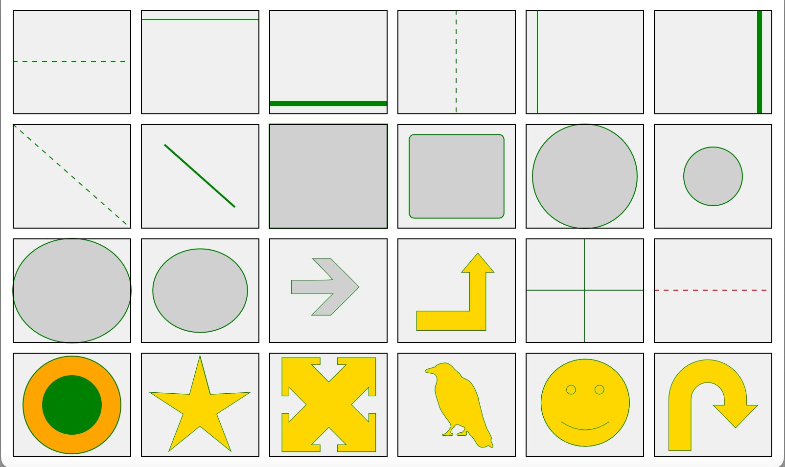
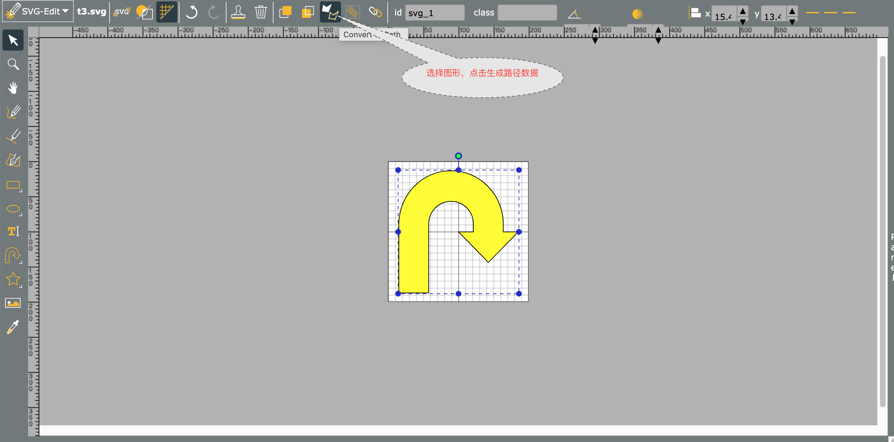
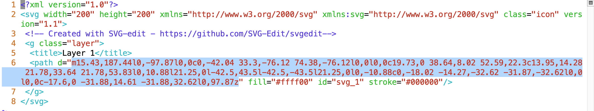

# shape 控件的使用方法



## 基本规则

* x/w 参数取值在 [0,1] 时，实际值为控件的宽度乘以该参数。
> 比如 x=0.5，那么实际的值为 0.5 * widget->w

* y/h 参数取值在 [0,1] 时，实际值为控件的高度乘以该参数。
> 比如 y=0.5，那么实际的值为 0.5 * widget->h

* r 参数取值在 [0,1] 时，实际值为宽度和高度的最小值乘以该参数。
> 比如 r=0.5 w=40 h=60，那么实际的值为 20。

## 公共参数

* stroke 线条颜色，默认黑色。none 表示不画线条。
* fill 填充颜色，默认白色。none 表示不填充。
* lw 线条宽度 (line width)，默认 1。

## 1.hline 

* 功能：画水平线

* 参数：
    * x（可选，默认 0) 起点 x 坐标。
    * y（可选，默认 0.5) 起点 y 坐标。
    * w（可选，默认 1) 宽度。
    * on（可选，画虚线时指定实线长度） 
    * off（可选，画虚线时指定虚线长度） 

如：
```xml
    <shape value="hline()" />
    <shape value="hline(stroke=red,lw=3)" />
    <shape value="hline(on=5,off=5)" />
    <shape value="hline(y=0.1)" />
    <shape value="hline(y=0.9)" />
```

## 2.vline 

* 功能：画垂直线

* 参数：
    * x（可选，默认 0) 起点 x 坐标。
    * y（可选，默认 0.5) 起点 y 坐标。
    * h（可选，默认 1) 高度。
    * on（可选，画虚线时指定实线长度） 
    * off（可选，画虚线时指定虚线长度） 

如：
```xml
    <shape value="vline()" />
    <shape value="vline(on=5,off=5)" />
    <shape value="vline(x=0.1)" />
    <shape value="vline(x=0.9)" />
```

## 3.line 

* 功能：画直线

* 参数：
    * x1（可选，默认 0) 起点 x 坐标。
    * y1（可选，默认 0) 起点 y 坐标。
    * x2（可选，默认 1) 终点 x 坐标。
    * y2（可选，默认 1) 终点 y 坐标。   
    * on（可选，画虚线时指定实线长度） 
    * off（可选，画虚线时指定虚线长度） 

如：
```xml
    <shape value="line()"/>
    <shape value="line(on=5,off=5)"/>
    <shape value="line(x1=0.2,y1=0.2,x2=0.8,y2=0.8)"/>
```

## 4.rect

* 功能：画矩形

* 参数：
    * x（可选，默认 0) 起点 x 坐标。
    * y（可选，默认 0.5) 起点 y 坐标。
    * w（可选，默认 1) 宽度。
    * h（可选，默认 1) 高度。   
    * r（可选，默认 0）圆角半径。

如：
```xml
    <shape value="rect()" />
    <shape value="rect(x=0.1,y=0.1,w=0.8,h=0.8,r=5)" />
```

## 5.circle

* 功能：画圆

* 参数：
    * x（可选，默认 0.5) 圆心 x 坐标。
    * y（可选，默认 0.5) 圆心 y 坐标。
    * r（可选，默认 0）半径。

如：
```xml
    <shape value="circle()" />
    <shape value="circle(r=30,stroke=red,fill=none)" />
```

## 6.ellipse

* 功能：画椭圆

* 参数：
    * x（可选，默认 0.5) 圆心 x 坐标。
    * y（可选，默认 0.5) 圆心 y 坐标。
    * rx（可选，默认 0.5）水平半径。
    * ry（可选，默认 0.5）垂直半径。

如：
```xml
    <shape value="ellipse()" />
    <shape value="ellipse(rx=0.4,ry=0.4)" />
```

## 7.text

* 功能：在指定的矩形中画文本

* 参数：
    * x（可选，默认 0) 起点 x 坐标。
    * y（可选，默认 0.5) 起点 y 坐标。
    * w（可选，默认 1) 宽度。
    * h（可选，默认 1) 高度。   
    * size （可选，默认 18)，字体大小。
    * color（可选，默认黑色），文本颜色。
    * text 文本内容    

如：
```xml
   text(text='hello world',size=20,color=red)
```

## 8.path

* 功能：画复杂的路径。

* 参数：
    * w 画布宽度。
    * h 画布高度。   
    * data 路径数据（兼容 SVG 路径）。
    
> 格式参考 https://developer.mozilla.org/en-US/docs/Web/SVG/Tutorial/Paths

如：
```xml
    <shape value="path(w=200,h=200,data='m88.27,126.32l20.55,-20.62l-39.73,0l-39.73,0l0,-12.76l0,-12.76l39.27,0c21.6,0 39.27,-0.65 39.27,-1.44c0,-0.79 -8.6,-10.07 -19.11,-20.62l-19.11,-19.18l17.66,0l17.66,0l26.97,27.03l26.97,27.03l-27.03,26.97l-27.03,26.97l-18.59,0l-18.59,0l20.55,-20.62z')" />
    <shape value="path(w=200,h=200,fill=gold,data='m23.46,139.08l101.38,0l0,-74.08l-15.54,0l31.08,-37.04l31.08,37.04l-15.54,0l0,111.12l-132.46,0z')" />
    <shape value="hline();vline()" />
    <shape value="hline(on=5,off=5,stroke=red)" />
    <shape value="circle(r=50,fill=orange);circle(r=30,fill=green)" />
    <shape value="path(w=200,h=200,fill=gold,data='m99.5,5.9l19.81,73.83l76.34,-3.98l-64.1,41.65l27.37,71.38l-59.42,-48.09l-59.42,48.09l27.37,-71.38l-64.1,-41.65l76.34,3.98l19.81,-73.83l19.81,73.83z')" />
    <shape value="path(w=200,h=200,fill=gold,data='m57.78,99.43l-33.14,-33.33l0,16.66l-13.29,0l0,-73.34l72.93,0l0,13.36l-16.57,0l33.14,33.33l33.14,-33.33l-16.57,0l0,-13.36l72.93,0l0,73.34l-13.29,0l0,-16.66l-33.14,33.33l33.14,33.33l0,-16.66l13.29,0l0,73.34l-72.93,0l0,-13.36l16.57,0l-33.14,-33.33l-33.14,33.33l16.57,0l0,13.36l-72.93,0l0,-73.34l13.29,0l0,16.66l33.14,-33.33z')" />
    <shape value="path(w=200,h=200,fill=gold,data='m58.58,27.36c3.94,-6.09 12.91,-7.17 19.7,-8c7.58,0.68 13.42,6.59 17.86,12.3c5.17,4.67 11.48,8.63 14.06,15.47c6.54,3.24 14.26,4.97 18.26,11.9c6.05,7.82 9.54,17.29 12.69,26.45c0.5,6.84 3.52,13.07 4.55,19.85c1.76,6.72 3.17,13.35 5.07,20.01c2.11,6.92 5.12,13.51 7.22,20.44c3.84,6.08 7.34,12.5 9.73,19.27c-5.71,-0.48 0.53,8.63 1.6,12.22c1.56,7.4 -6.99,3.16 -8.49,-0.25c-5.28,5 -16.1,6.12 -20.88,-0.44c-5.04,-6.64 -7.83,-15.08 -14.79,-19.89c-2.74,-2.28 -5.39,-12.22 -6.37,-3.44c3.48,8.74 -10.2,3.76 -15.06,5.33c-8.71,-1.75 3.31,-6.73 7,-6.14c3.48,-3.46 9.26,-9.25 0.96,-11.07c-5.69,-2.26 -12.98,-7.99 -16.17,0.54c-4.01,2.12 -11.21,12.2 -3.24,12.94c3.22,6.59 -9.29,1.82 -12.79,3.38c-3.29,1.04 -11.5,-0.78 -3.86,-2.45c6.58,-1.08 9.72,-9.16 13.85,-14.06c-0.14,-6.28 -5.16,-11.26 -8.93,-16.01c-4.01,-6.68 -9.6,-12.41 -12.39,-19.72c-1.83,-7.6 -5.31,-14.62 -7.07,-22.23c-1.99,-7.63 -4.28,-16.23 0.01,-23.54c1.95,-6.41 2.77,-12.4 -1.33,-17.68c-5.66,-4.6 -13.72,-2.76 -20.25,-5.81c-0.79,-4.93 9.67,-6.81 14.22,-7.91c1.73,-0.06 3.05,-1.5 4.84,-1.47z')" />
    <shape value="path(w=200,h=200,fill=gold,data='m55.01,132.22q45.8,31.08 91.49,0m-81.57,-61.39c0,-4.8 3.94,-8.7 8.8,-8.7c4.86,0 8.8,3.89 8.8,8.7c0,4.8 -3.94,8.7 -8.8,8.7c-4.86,0 -8.8,-3.89 -8.8,-8.7m54.14,0c0,-4.8 3.94,-8.7 8.8,-8.7c4.86,0 8.8,3.89 8.8,8.7c0,4.8 -3.94,8.7 -8.8,8.7c-4.86,0 -8.8,-3.89 -8.8,-8.7m-102.77,24.97l0,0c0,-46.12 37.83,-83.5 84.5,-83.5c46.67,0 84.5,37.38 84.5,83.5c0,46.12 -37.83,83.5 -84.5,83.5c-46.67,0 -84.5,-37.38 -84.5,-83.5zm0,0l0,0c0,-46.12 37.83,-83.5 84.5,-83.5c46.67,0 84.5,37.38 84.5,83.5c0,46.12 -37.83,83.5 -84.5,83.5c-46.67,0 -84.5,-37.38 -84.5,-83.5z')" />
    <shape value="path(w=200,h=200,fill=gold,data='m15.43,187.44l0,-97.87l0,0c0,-42.04 33.3,-76.12 74.38,-76.12l0,0l0,0c19.73,0 38.64,8.02 52.59,22.3c13.95,14.28 21.78,33.64 21.78,53.83l0,10.88l21.25,0l-42.5,43.5l-42.5,-43.5l21.25,0l0,-10.88c0,-18.02 -14.27,-32.62 -31.87,-32.62l0,0l0,0c-17.6,0 -31.88,14.61 -31.88,32.62l0,97.87z')" />
```

## 复合图形

可以按顺序调用多个函数，函数之间用英文的分号；分隔。

如：

```xml
<shape value="rect();text(text='hello',size=20,color=red)" />
<shape value="circle(r=50,fill=orange);circle(r=30,fill=green)" />
```

## 使用 svg editor 绘制路径

* 用浏览器打开 [SVG Editor](https://unpkg.com/svgedit@7.1.3/dist/editor/index.html)

* 编辑 SVG，并生成路径数据。



* 下载 SVG 图片，并用文本编辑器打开，拷贝出 path 数据。


